# OpenGL-RealTime-Offline-Rendering

* Ruijun(Daniel) Zhong
    * [LinkedIn](https://www.linkedin.com/in/daniel-z-73158b152/)    
    * [Personal Website](https://www.danielzhongportfolio.com/)
* Tested on: 
  * Core(TM) i7-12700K 3.61 GHz 32.0 GB, NVIDIA GeForce RTX 3070 Ti (personal computer)   
    * Maya 2022, Houdini 20.0.590, Visua Studio 2022

## Real Time Rendering
|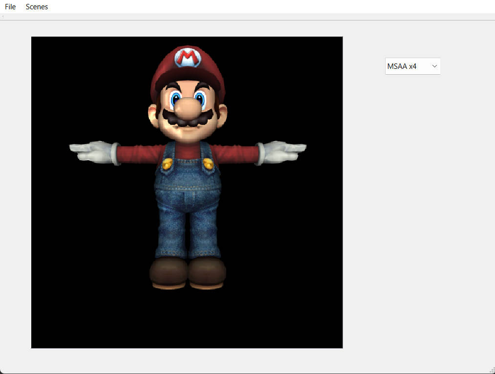||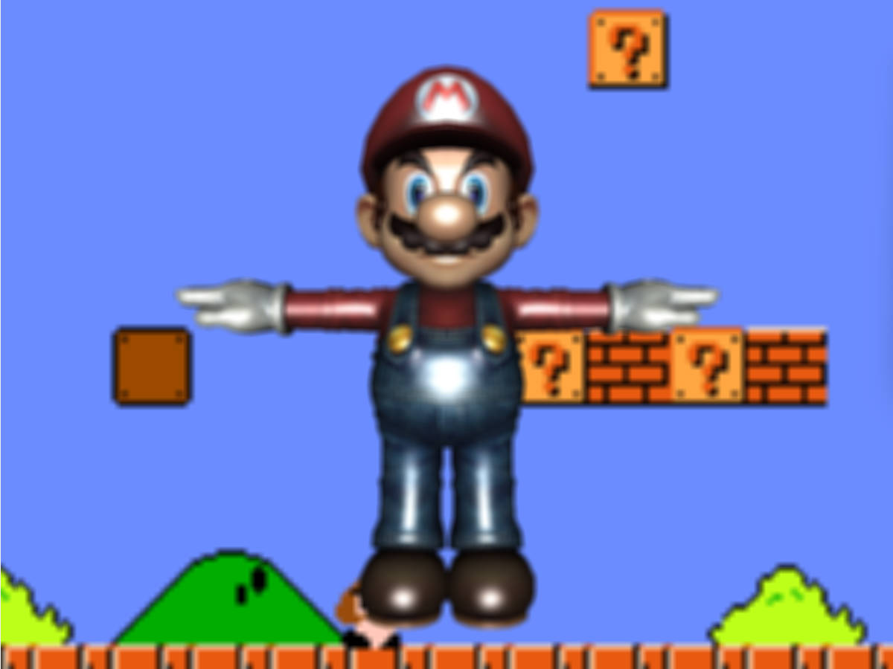|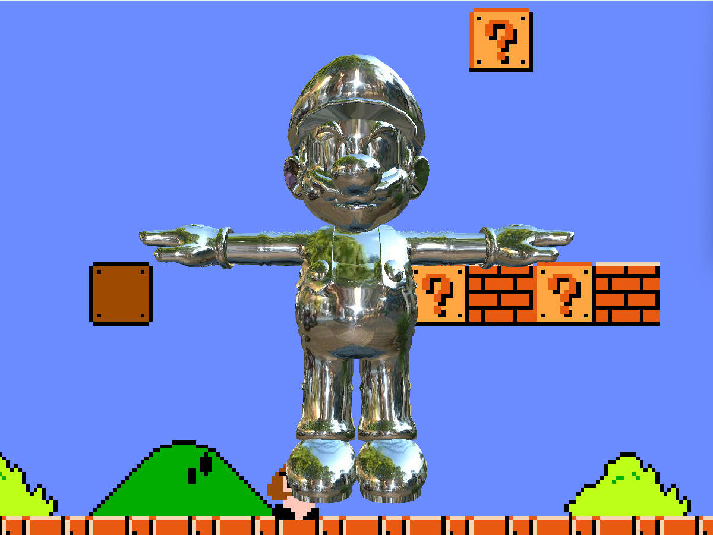|
|:-:|:-:|:-:|:-:|
|C++ Rasterizer|Blinn-Phong|Guassin Blur|MatCap|
|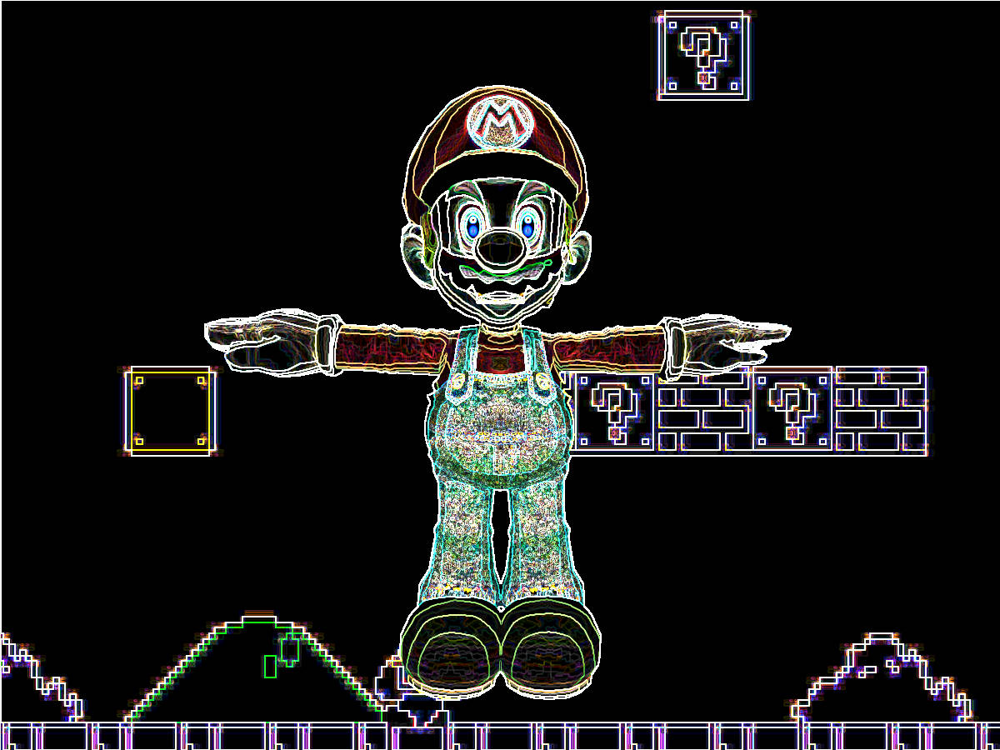|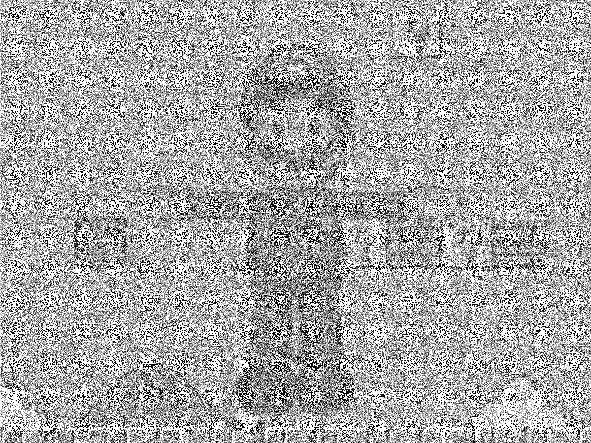|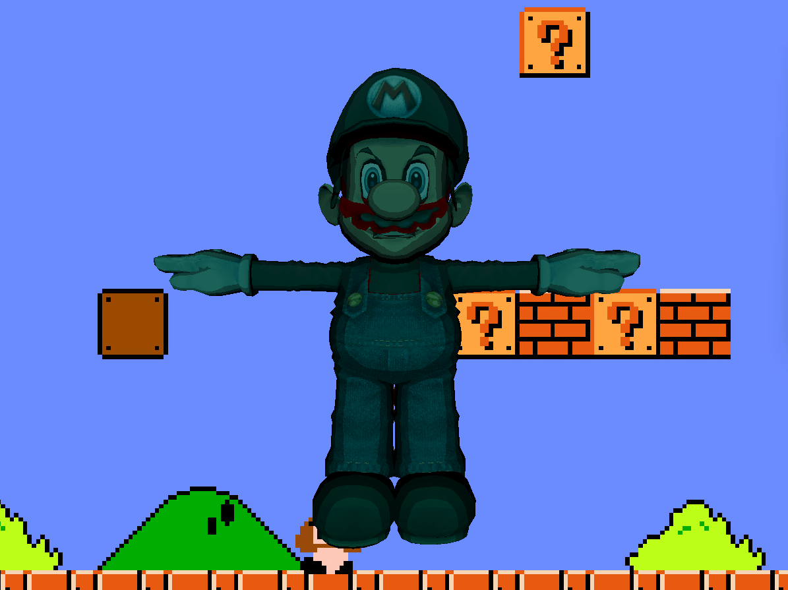||
|Sobel Filter|Pointilism|Toon Shader + Perlin Noise|Anaglyph|

## Paht Tracing
|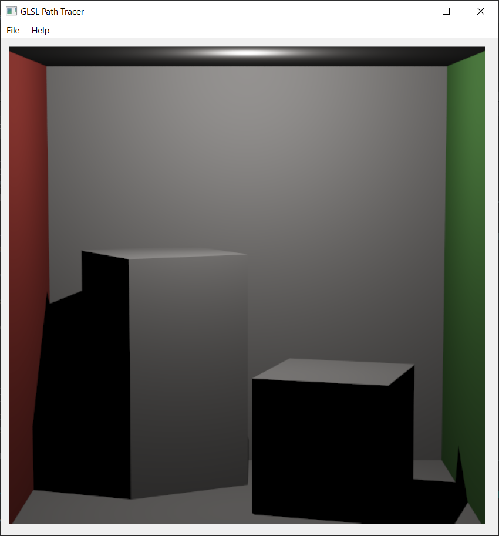|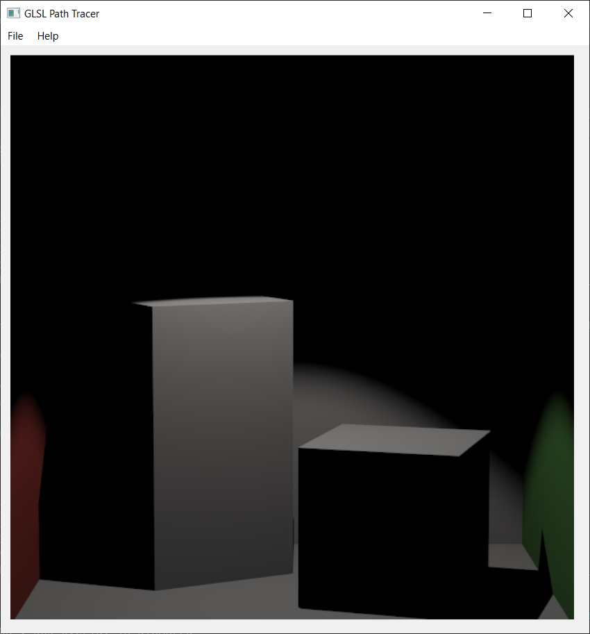|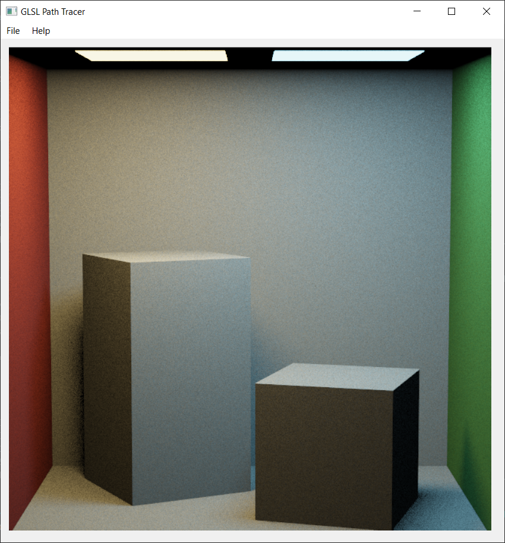|
|:-:|:-:|:-:|
|Point Light|Spot Light|Area Lights|
|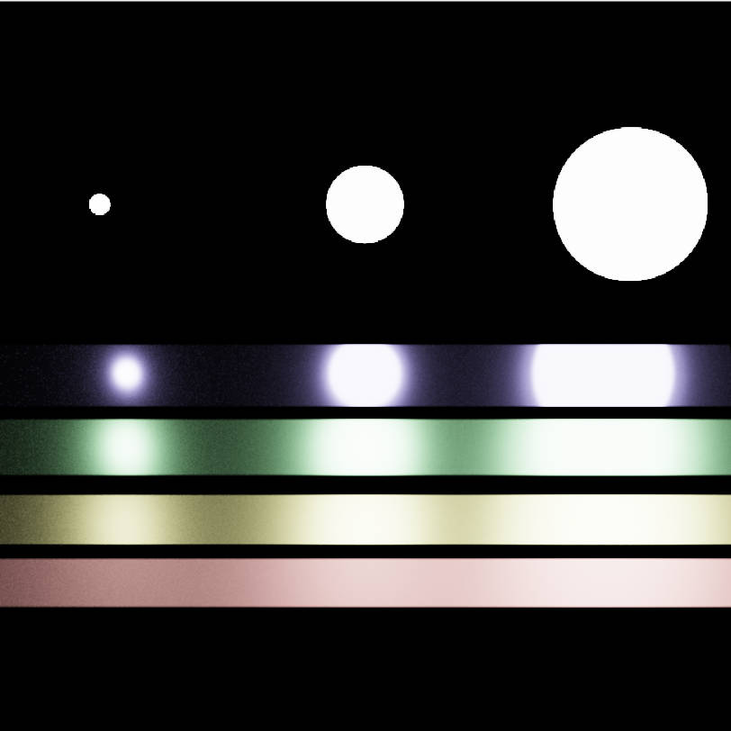|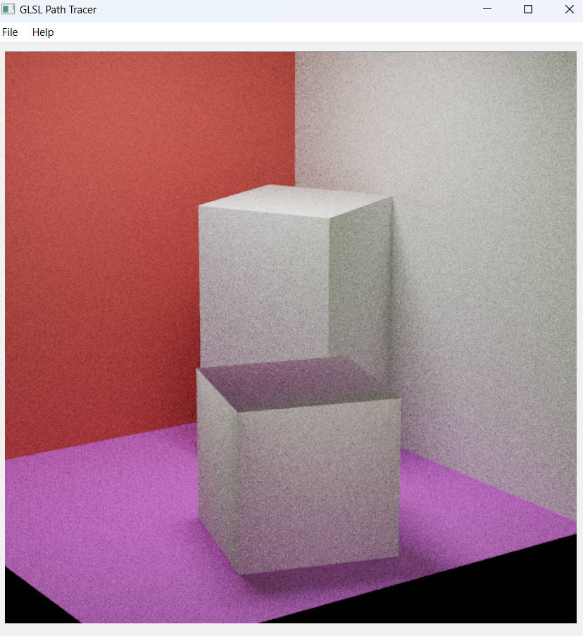|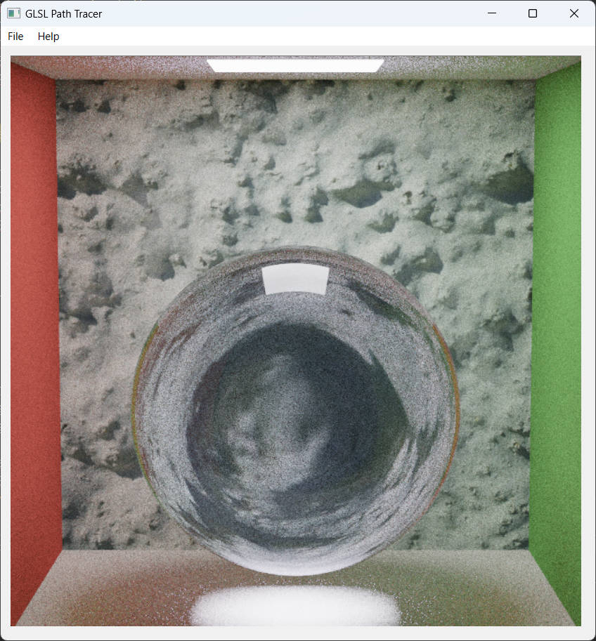||
|Microfacet Metal|BSDF Diffuse|Reflect & Transmit|
